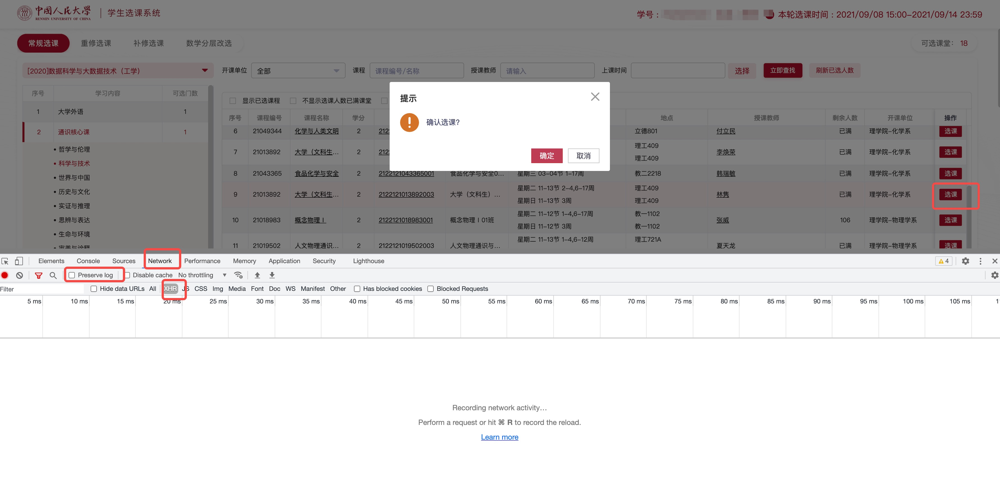
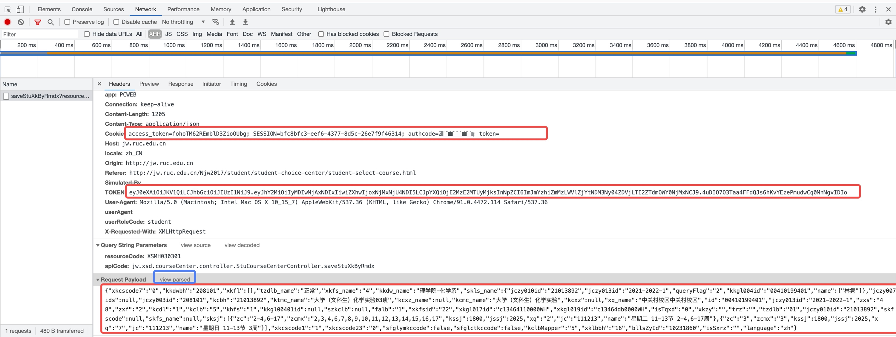

# fuckxk

微人大课程中心自动选课器。适用于比手速抢课阶段的自动抢课。

抢课器的原理是: 模拟登录进抢课系统, 然后每五秒钟点一次选课按钮并确认, 直到选课成功。


**低调使用！**


## 环境要求

Python3

## 如何使用

### 前期准备：需要给程序配一下cookie来模拟系统登录

1. 在chrome中登录选课系统后，找到你要抢的课。打开chrome控制台（F12），切换至network模式。勾选preserve log按钮。点击“XHR”，这样会把除了XHR请求外的其他请求过滤掉，更加方便我们查看。（见下图红框处）



2. 点击选课按钮，并确定。控制台中会刷出几个请求。找到以saveStu开头的那个请求，点开，如下图。



先点击右侧Request Payload旁边的view source(见上图中蓝框)，把它下面的东西转成字符串。

然后，把Cookie, TOKEN, 以及Request Payload中的内容复制下来(见上图中的三个红框)。

3. 打开```start.py```。修改代码头部的```request_data```, ```cookie_data```, ```token_data```变量中的内容为你刚才复制的对应内容。

### 抢课

运行命令: ```python start.py```

当课程没有名额时，程序会一直输出```eywxt.save.stuLimit.error```字样。

接下来你需要耐心等待。等到程序输出```success```字样, 就说明你抢到课了。(亲测，通识课一般半小时内都能抢到:)

## Notes

你的登录Cookie会在每天晚上系统维护时失效。因此，如果你想跨天抢课，需要在第二天系统恢复时重复以上过程，再把程序跑上。

